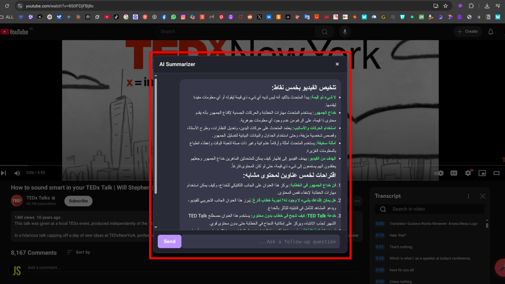
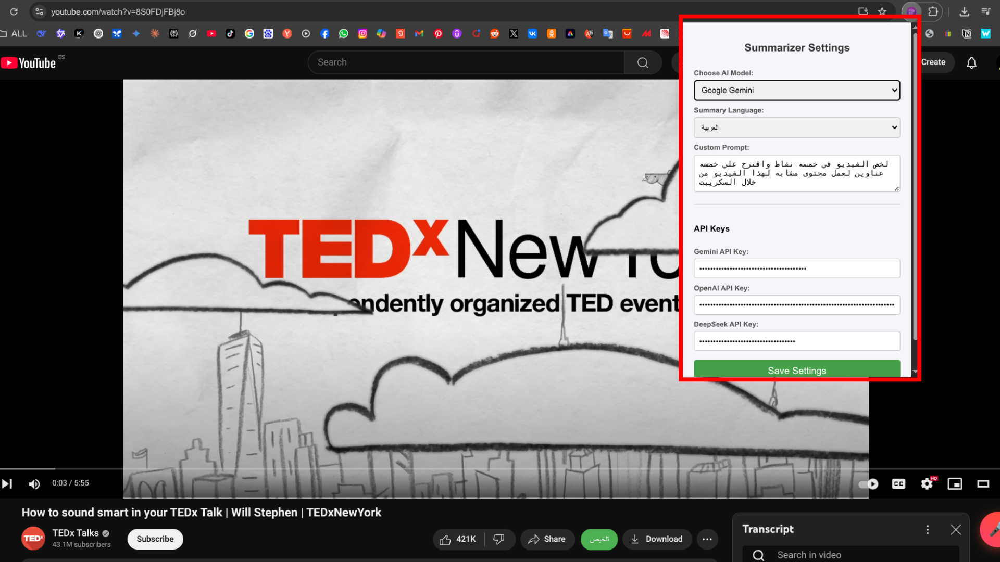
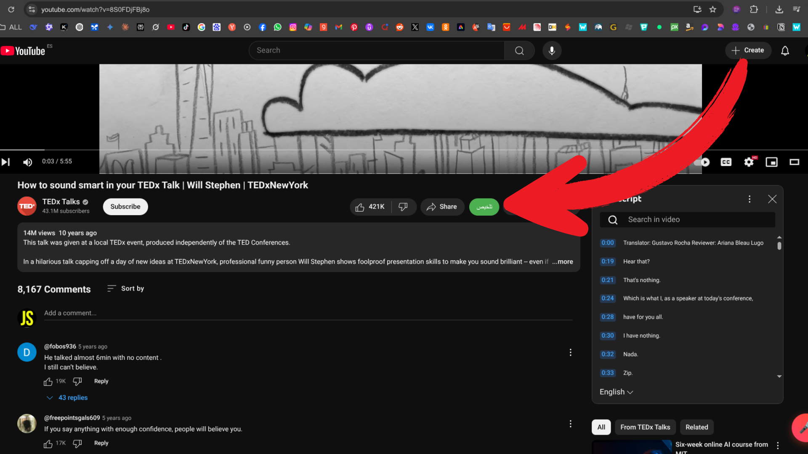

# YouTube AI Summarizer Extension

A browser extension to summarize YouTube videos using AI, with support for multiple models and languages.

---

## ✨ Features

- **Integrated 'Summarize' Button:** A "Summarize" button appears directly on the YouTube page.
- **Multi-Model Support:** Choose between Google Gemini, OpenAI, or DeepSeek.
- **Full Customization:**
    - Write your own custom prompt (e.g., "Summarize in 5 bullet points").
    - Select the summary's output language (English, Arabic, French, Spanish).
- **Interactive Chat Interface:** Ask follow-up questions about the summary and continue the conversation with the AI.
- **Advanced Markdown Formatting:** AI responses are beautifully rendered with Markdown formatting.
- **Multi-language & RTL Support:** The interface correctly handles right-to-left text direction for languages like Arabic.

## 🛠️ How to Install

As this extension is not yet published on the Chrome Web Store, you can install it manually by following these steps:

1.  Download this project by clicking the green `Code` button, then `Download ZIP`.
2.  Unzip the downloaded file.
3.  Open the Google Chrome browser and navigate to `chrome://extensions`.
4.  In the top right corner, enable **"Developer mode"**.
5.  Click the **"Load unpacked"** button.
6.  Select the unzipped folder from step 2.

The extension is now installed and ready to use!

## ⚙️ Configuration & Screenshots

Here is how to set up the extension:

**1. Configure your settings and API keys in the popup.**

**2. The "Summarize" button will then appear on any YouTube video with a transcript.**

---
This project was developed in collaboration with Gemini.
